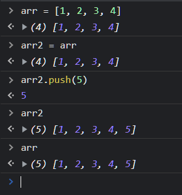
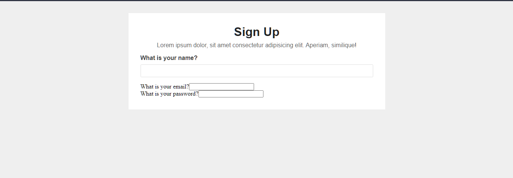
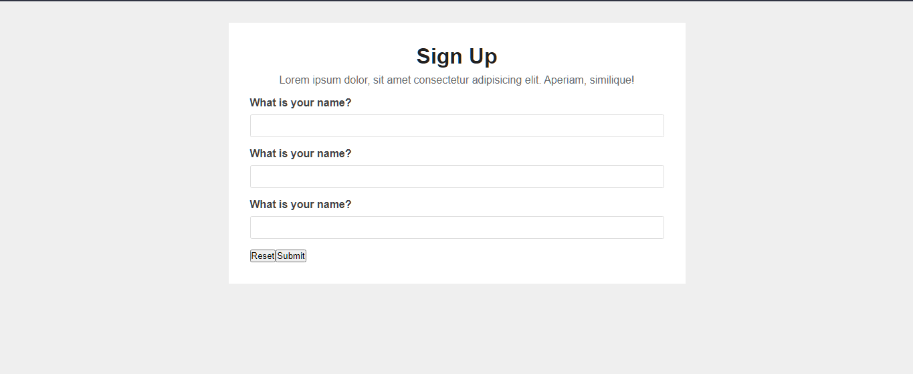
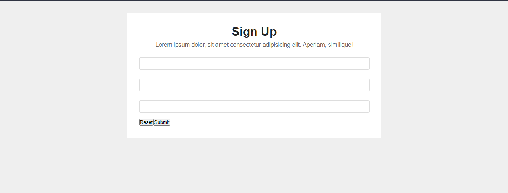
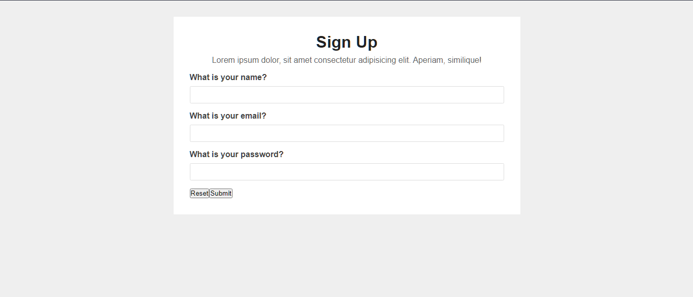
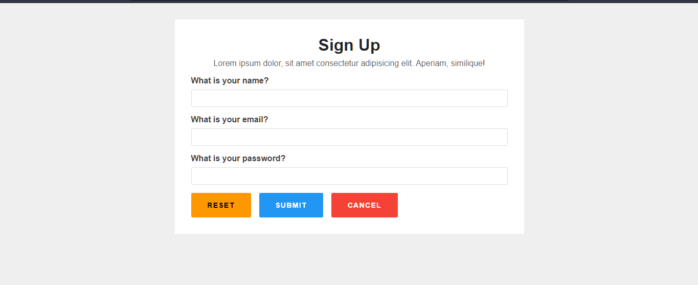
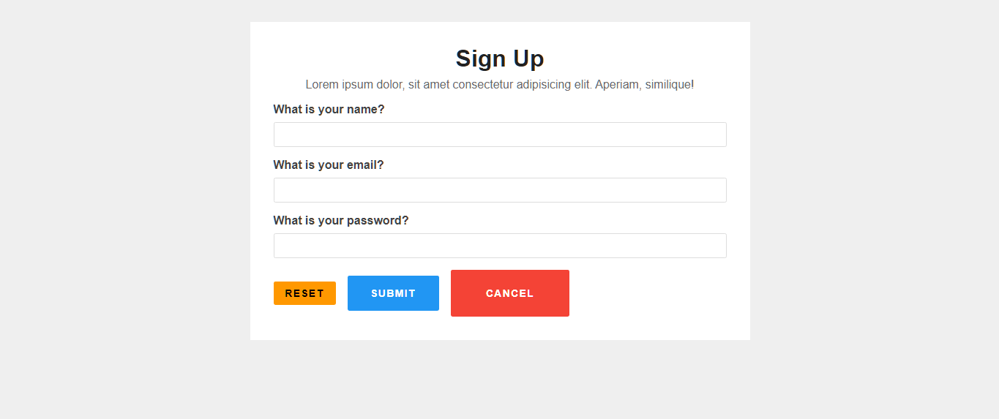

# Lecture 30 [Frontend 3] - Understand React Functional Component

## Introduction

বর্তমানে দুনিয়া আস্তে আস্তে রিয়্যাক্টের ক্লাস বেইজড কম্পোনেন্ট থেকে সরে যাচ্ছে। কেন সরে যাচ্ছে তা আমাদের বুঝতে হবে একটু। রিয়্যাক্ট যখন প্রথম আসলো তখন ছিল অবজেক্ট বা মেথড টাইপের। যেটা আমরা গত ক্লাসে একটু দেখেছিলাম। সেখানে `React.createElement()` টাইপের কিছু মেথড ছিল। সেগুলো ব্যবহার করে অবজেক্টের মতো করে আমাদের UI তৈরি করতে হতো। যেটা খুবই জটিল। আমরা গত ক্লাসে দেখেছিলাম এভাবে UI তৈরি করা কতটা জটিল কাজ। এরপর আসলো ক্লাস বেইজড কম্পোনেন্ট যেখানে jsx এর সাথে পরিচয় করিয়ে দেয়া হলো। যার মাধ্যমে আমরা খুব সহজেই আমাদের UI তৈরি করে ফেলতে পারি একদম HTML এ কোড করার মতো। এটা দিয়ে প্রায় রিয়্যাক্টের ১৬.৩ ভার্সন পর্যন্ত ব্যবহার করা হয়েছে। তার আগে ফাংশনাল কম্পোনেন্ট বা hooks বলতে কিছু ছিল না। যদিও ফাংশন দিয়ে কম্পোনেন্ট তৈরি করা যেতো, কিন্তু এতে কোনো ফাংশনালিটিজ ছিল না। নাম হচ্ছে ফাংশনাল কম্পোনেন্ট কিন্তু এটাতে কোনো ফাংশনই নাই। কী অদ্ভূত ব্যাপার! তাই না? সেখানে শুধু কিছু প্রপস পাস করা যেতো এবং যেই কম্পোনেন্টগুলোতে কোনো ফাংশনালিটিজ নেই সেই কম্পোনেন্টগুলো তৈরি করা হতো ফাংশন দিয়ে। এই কনসেপ্ট থে বের হয়ে রিয়্যাক্ট ১৬.৩ এ আমাদের এমন একটা কনসেপ্টের সাথে পরিচয় হলো যেখানে প্রায় ৯৯% কাজ যেমন স্টেট ডিফাইন করা, লাইফসাইকেল ইভেন্ট রিলেটেড কাজ ইত্যাদি কাজ আগে যা ক্লাস দিয়ে করা হতো সেগুলো সব ফাংশনের মাধ্যমে করা যায়। ১% জায়গা যেমন এরর বাউন্ডারি রিলেটেড কাজ, এই টাইপের কিছু সীমিত কাজ আছে যেখানে এখনো ক্লাস বেইজড কম্পোনেন্ট ব্যবহার করতে হয়। তবে এর ব্যবহার খুবই সীমিত।

## কেন ক্লাস থেকে ফাংশনে জাম্প করার সিদ্ধান্ত হলো

- প্রথম ইস্যু হলো পারফরম্যান্স ইস্যু। ক্লাসের ইন্সট্যানশিয়েট করা অনেক কস্টলি। অর্থাৎ সিপিইউ এর প্রচুর স্পেস লাগে একেকটা ক্লাস ইন্সট্যানশিয়েট করতে। যেহেতু রিয়্যাক্ট ফ্রন্টএন্ড লাইব্রেরি সেক্ষেত্রে এই কস্ট বহন করবে ইউজার। যদি ইউজারের একটা লো এন্ড পিসি থাকে তাহলে সে স্মুদলি অ্যাপ্লিকেশন রান করতে পারবে না। এসব কথা মাথায় রেখে ফাংশনাল কম্পোনেন্টের কনসেপ্টটা এসেছে। ফাংশনাল কম্পোনেন্টের পারফরম্যান্স ক্লাস বেইজ কম্পোনেন্টের চেয়ে অনেক ফাস্ট এবং কম স্পেস লাগে সিপিইউ এর। তাই একজন লো এন্ড পিসির ইউজারও খুব আরামে অ্যাপ্লিকেশন ব্যবহার করতে পারে।
- দ্বিতীয় আরেকটা কারণ হলো, রিয়্যাক্টের সবকিছু হচ্ছে ভার্চুয়াল ডমে। ভার্চুয়াল ডম মানে হচ্ছে যে ডমটা আমরা দেখতে পাচ্ছি তার মতো একই ডমের ক্লোন র‍্যামে মজুত থাকে। সেটা আমরা দেখতে পারবো না। কিন্তু থাকে। এখন ক্লাস কম্পোনেন্টের ক্ষেত্রে সমস্যাটা হচ্ছে ক্লাস মিউটেবল ওয়েতে কাজ করে। অর্থাৎ মেমোরির কোনো একটা ব্লকে যদি আমরা স্টেট বা অ্যাড্রেস রাখি এবং অন্য ব্লকে ডাটা রাখি যখন চেইঞ্জ হয় তখন অ্যাড্রেসটা চেইঞ্জ হয় না, কিন্তু ডাটাটা চেইঞ্জ হয়ে যায়। এখন রিয়্যাক্টের ক্ষেত্রে এই যে ডাটা চেইঞ্জিং এটা বুঝতে পারাটা অনেক কঠিন। এর জন্য অনেক জটিল জটিল অ্যালগরিদম অ্যাপ্লাই করতে হচ্ছে, কমপ্লেক্স কাজ করতে হচ্ছে। এসব করতে গিয়ে অনেক পারফরম্যান্স ইস্যু তৈরি হয়। এটার থেকে বাঁচার জন্য আমাদের উপায় হলো ইমমিউটেবল ওয়েতে কাজ করা। তাহলে যখন স্টেট চেইঞ্জ হবে তখন অ্যাড্রেসও চেইঞ্জ হবে ডাটাও চেইঞ্জ হবে। তাহলে সহজেই এই ডাটা চেইঞ্জিংটা বুঝা যাবে। তাই ক্লাস বেইজড কম্পোনেন্ট বাদ দিয়ে ফাংশনাল কম্পোনেন্ট এসেছে। এর জন্য বেটার পারফরম্যান্স পাওয়া যাচ্ছে।

### মিউটেবলের উদাহরণ



আমরা প্রথমে একটা অ্যারে ডিফাইন করলাম `arr` নামে। বিহাইন্ড দ্য সীন `arr` এর মধ্যে আছে আমাদের অ্যারের অ্যাড্রেসটা। এখন যখন আমরা `arr2` ভ্যারিয়েবলে `arr` অ্যাসাইন করললাম তখন `arr` এর অ্যাড্রেসটা `arr2` এর মধ্যে কপি হয়ে গেলো। যেহেতু `arr` এবং `arr2` এর অ্যড্রেস সেইম সেহেতু `arr2` এর ডাটা চেইঞ্জ করলে `arr` এর ডাটাও চেইঞ্জ হচ্ছে। এটাকেই মূলত বলা হচ্ছে মিউটেবিলিটি।

## ফাংশনাল কম্পোনেন্টের সুবিধা

ফাংশনাল কম্পোনেন্টের সুবিধা হলো -

- এটা ডেভেলপার ফ্রেন্ডলি।
- ক্লাসে স্টেট ম্যানেজমেন্টের চেয়ে ফাংশনে স্টেট ম্যানেজমেন্ট করা অনেক সহজ। স্টেট মানে হলো যেটার উপর ভিত্তি করে রিয়্যাক্ট ডিসিশন নিবে UI কিরকম চেইঞ্জ হবে।
- জাভাস্ক্রিপ্ট ডেভেলপাররা একটু সবসময় অবজেক্ট অরিয়েন্টেড প্রোগ্রামিং এড়িয়ে চলে। তাই ফাংশনাল কম্পোনেন্ট আসার পর এটা ডেভেলপাররা খুব সহজেই আয়ত্ত্ব করে নিতে পারছে।

## কিভাবে কম্পোনেন্ট বানাতে হবে

যখন কোনো একটা অ্যাপ্লিকেশন আমরা বানানো শুরু করবো তখন শুধু একটা কম্পোনেন্টই বানাবো। সেটা যতো বড় হবে হোক, যতো jsx লেখা লাগে লাগুক। লিখতে লিখতে যখন দেখবো একটা ফাংশনালিটিজ আমাদের বারবার লাগছে তখন আমরা সেটার জন্য একটা রিইউজেবল কম্পোনেন্ট বানিয়ে ফেলবো। আজকে আমরা কিছু একটা বানানোর চেষ্টা করি। আমরা একটা সাইন আপ ফর্ম বানাই। আমরা আমাদের App.jsx এ কিছু লিখি। কিভাবে রিয়্যাক্ট অ্যাপ ক্রিয়েট করতে হয় তা গত ক্লাসে বলা হয়েছে। আপনারা আশা করি জানেন।

```jsx
// App.jsx

function App() {
	return (
		<div>
			<div>
				<h3>Sign Up</h3>
				<p>
					Lorem ipsum dolor, sit amet consectetur adipisicing elit. Aperiam,
					similique!
				</p>
			</div>

			<form>
				<div>
					<label htmlFor="name">What is your name?</label>
					<input type="text" id="name" />
				</div>

				<div>
					<label htmlFor="email">What is your email?</label>
					<input type="email" id="email" />
				</div>

				<div>
					<label htmlFor="password">What is your password?</label>
					<input type="password" id="password" />
				</div>

				<div>
					<button type="reset">Reset</button>
					<button type="submit">Submit</button>
				</div>
			</form>
		</div>
	);
}

export default App;
```

এরপর আমরা নিচের কমান্ড লিখে আমাদের অ্যাপ্লিকেশন রান করাবো।

```sh
yarn start
```

আমাদের অ্যাপ্লিকেশনটা দেখতে খুবই জঘন্য দেখাচ্ছে। আমরা এবার ইনলাইন সিএসএস লিখবো। রিয়্যাক্টে ইনলাইন সিএসএস লিখতে হয় জাভাস্ক্রিপ্ট অবজেক্ট আকারা। প্রথমে আমাদের লিখতে হবে `style={}`. যেকোনো জাভাস্ক্রিপ্ট কোড লেখার জন্য আগে আমাদের একজোড়া কার্লি ব্র্যাকেট দিতে হবে। এরপর এই ব্র্যাকেটের মধ্যে আমরা আমাদের সিএসএস অবজেক্টটা লিখবো। যেমনঃ `style={{ width: '60%', padding: '2rem' }}`। আমরা যেভাবে অবজেক্ট লিখি ঠিক সেরকমই লিখবো। এখানে অনেকে দুইজোড়া কার্লি ব্র্যাকেট দেখে কনফিউজ হয়ে যেতে পারেন। জাস্ট মনে রাখবেন কোনো জাভাস্ক্রিপ্ট কোড লেখার জন্য আমাদের আগের এক জোড়া কার্লি ব্র্যাকেট দিতে হবে। আর যেহেতু আমরা অবজেক্ট লিখছি তার জন্য আরেক জোড়া কার্লি ব্র্যাকেট দিয়েছি।

```jsx
// App.jsx

function App() {
	return (
		<div
			style={{
				width: '50%',
				margin: '2rem auto',
				backgroundColor: '#fff',
				padding: '2rem',
			}}
		>
			<div
				style={{
					textAlign: 'center',
					display: 'flex',
					flexDirection: 'column',
					gap: '0.5rem',
					marginBottom: '1rem',
				}}
			>
				<h3 style={{ fontFamily: 'Arial', fontSize: '2rem', color: '#222' }}>
					Sign Up
				</h3>
				<p style={{ fontFamily: 'Arial', fontSize: '1rem', color: '#666' }}>
					Lorem ipsum dolor, sit amet consectetur adipisicing elit. Aperiam,
					similique!
				</p>
			</div>

			<form>
				<div
					style={{
						display: 'flex',
						flexDirection: 'column',
						gap: '0.5rem',
						marginBottom: '1rem',
					}}
				>
					<label
						style={{
							fontFamily: 'Arial',
							fontSize: '1rem',
							color: '#424242',
							fontWeight: 'bold',
						}}
						htmlFor="name"
					>
						What is your name?
					</label>
					<input
						style={{
							padding: '0.5rem 1rem',
							outline: 'none',
							border: '1px solid #ddd',
							borderRadius: '0.15rem',
							fontFamily: 'Arial',
							fontSize: '0.9rem',
							color: '#666',
						}}
						type="text"
						id="name"
					/>
				</div>

				<div>
					<label htmlFor="email">What is your email?</label>
					<input type="email" id="email" />
				</div>

				<div>
					<label htmlFor="password">What is your password?</label>
					<input type="password" id="password" />
				</div>

				<div>
					<button type="reset">Reset</button>
					<button type="submit">Submit</button>
				</div>
			</form>
		</div>
	);
}

export default App;
```

```css
/* index.css */

* {
	margin: 0;
	padding: 0;
	box-sizing: border-box;
}

body {
	background-color: #efefef;
}
```

এবার আমাদের UI দেখতে এরকম হবে।



এখন আমাদের ইমেইল এবং পাসওয়ার্ড দুইটা ডিভ দেখতেও একইরকম হবে। নরমাল এইচটিএমএলে হলে আমরা জাস্ট কপি করে পেস্ট করে টেক্সট চেইঞ্জ করে দিতাম। কিন্তু যেহেতু আমরা রিয়্যাক্টে আছি। সেহেতু আমরা একটা রিইউজেবল কম্পোনেন্ট বানাবো।

- কখন আমরা একটা নতুন কম্পোনেন্ট বানানোর সিদ্ধান্ত নিবো?
  - যখন আমাদের ডুপ্লিকেট কোড লিখতে হবে।

এখন আমরা যদি এই অ্যাপ্লিকেশনে নেইম, ইমেইল এবং পাসওয়ার্ডের জন্য যদি একটা কম্পোনেন্ট বানাতে যাই তাহলে আমাদের চ্যালেঞ্জ কী হতে পারে? প্রথম চ্যালেঞ্জ হচ্ছে এই তিনটা ডিভ দেখতে একই রকম হলেও এদের লেবেল আলাদা, এদের বিহেভিয়ার আলাদা। তাহলে আমাদের এমন একটা সিস্টেম করতে হবে যেটার মাধ্যমে আমরা এসব ম্যানেজ করতে পারবো। তার আগে আমরা একটা কম্পোনেন্ট বানিয়ে ফেলি আগে। তার জন্য আমাদের src ফোল্ডারের মধ্যে components নামে আরেকটা ফোল্ডার ক্রিয়েট করবো। সেটার মধ্যে আমরা input-group নামে আরেকটা ফোল্ডার ক্রিয়েট করবো। সেখানে আমরা একটা ফাইল ক্রিয়েট করবো InputGroup.jsx নামে। কম্পোনেন্টের নাম সাধারণত ক্যাপিটাল লেটার দিয়ে শুরু হয়। এরপর আমরা কম্পোনেন্ট তৈরি করবো।

```jsx
// InputGroup.jsx

const InputGroup = () => {
	return (
		<div
			style={{
				display: 'flex',
				flexDirection: 'column',
				gap: '0.5rem',
				marginBottom: '1rem',
			}}
		>
			<label
				style={{
					fontFamily: 'Arial',
					fontSize: '1rem',
					color: '#424242',
					fontWeight: 'bold',
				}}
				htmlFor="name"
			>
				What is your name?
			</label>
			<input
				style={{
					padding: '0.5rem 1rem',
					outline: 'none',
					border: '1px solid #ddd',
					borderRadius: '0.15rem',
					fontFamily: 'Arial',
					fontSize: '0.9rem',
					color: '#666',
				}}
				type="text"
				id="name"
			/>
		</div>
	);
};

export default InputGroup;
```

এরপর এই কম্পোনেন্ট আমরা App.jsx এ ইমপোর্ট করে যতবার খুশি ইউজ করতে পারি।

```jsx
// App.jsx

import InputGroup from './components/input-group/InputGroup';

function App() {
	return (
		<div
			style={{
				width: '50%',
				margin: '2rem auto',
				backgroundColor: '#fff',
				padding: '2rem',
			}}
		>
			<div
				style={{
					textAlign: 'center',
					display: 'flex',
					flexDirection: 'column',
					gap: '0.5rem',
					marginBottom: '1rem',
				}}
			>
				<h3 style={{ fontFamily: 'Arial', fontSize: '2rem', color: '#222' }}>
					Sign Up
				</h3>
				<p style={{ fontFamily: 'Arial', fontSize: '1rem', color: '#666' }}>
					Lorem ipsum dolor, sit amet consectetur adipisicing elit. Aperiam,
					similique!
				</p>
			</div>

			<form>
				<InputGroup />
				<InputGroup />
				<InputGroup />

				<div>
					<button type="reset">Reset</button>
					<button type="submit">Submit</button>
				</div>
			</form>
		</div>
	);
}

export default App;
```

এবার যদি আমাদের আউটপুট দেখি দেখবো এরকম দেখাবে।



দেখলাম আমাদের তিনটা কম্পোনেন্টই চলে এসেছে একইভাবে। কিন্তু এখানে একটা সমস্যা আছে। সমস্যাটা হলো সব জায়গায় আমাদের ডাটা সেইম। ডাটা সেইম হলে তো হবে না। আমাদের চেইঞ্জ করতে হবে।

কম্পোনেন্ট বানানোর সময় আমাদের মাথায় রাখতে হবে কোন কোন ডাটা আমাদের চেইঞ্জ করতে হবে। এক্ষেত্রে আমাদের লেবেল ভিন্ন, ইনপুট টাইপ ভিন্ন, আইডি ভিন্ন। এগুলোর উপর ভিত্তি করে আমাদেরকে কম্পোনেন্টকে একটু মডিফাই করতে হবে।

```jsx
// InputGroup.jsx

const InputGroup = () => {
	const label = 'What is your name?';

	return (
		<div
			style={{
				display: 'flex',
				flexDirection: 'column',
				gap: '0.5rem',
				marginBottom: '1rem',
			}}
		>
			<label
				style={{
					fontFamily: 'Arial',
					fontSize: '1rem',
					color: '#424242',
					fontWeight: 'bold',
				}}
				htmlFor="name"
			>
				{label}
			</label>
			<input
				style={{
					padding: '0.5rem 1rem',
					outline: 'none',
					border: '1px solid #ddd',
					borderRadius: '0.15rem',
					fontFamily: 'Arial',
					fontSize: '0.9rem',
					color: '#666',
				}}
				type="text"
				id="name"
			/>
		</div>
	);
};

export default InputGroup;
```

আমরা যদি আমাদের লেভেল টেক্সটকে একটা ভ্যারিয়েবলের মধ্যে রেখে সেই ভ্যারিয়েবলকে লেবেলের মধ্যে পাস করি তাহলে আমরা কোনো চেইঞ্জ দেখতে পারবো না। অর্থাৎ আমরা চাইলে jsx এর মধ্যে ডাটাকে ভ্যারিয়েবল হিসেবেও পাস করতে পারি। তার মানে আমরা যদি ভ্যারিয়েবলের ডাটাকে চেইঞ্জ করে দিতে পারি তাহলে আমাদের লেবেলের ডাটাও চেইঞ্জ হয়ে যাবে। সেটা করা যেতে পারে যদি আমরা বাইরে থেকে এই ভ্যারিয়েবলকে পাস করতে পারি।

সেক্ষেত্রে আমরা জাভাস্ক্রিপ্ট ফাংশন যেহেতু বানাচ্ছি আমরা আর্গুমেন্ট হিসেবে ভ্যারিয়েবল নিতে পারি। কিন্তু রিয়্যাক্ট শুধুমাত্র একটা আর্গুমেন্ট গ্রহণ করবে। একের অধিক আর্গুমেন্ট সে গ্রহণ করবে না। সেটার নাম হলো `props` এবং এটা হলো একটা ফাঁকা অবজেক্ট। এখন প্রশ্ন হলো এই অবজেক্টে ডাটা আসবে কোত্থেকে? সেটা আসবে আমরা যে জায়গায় কম্পোনেন্ট কল করছি সেখান থেকে। নরমাল ফাংশনের ক্ষেত্রে যেমন আমরা ফাংশন কল যেখানে করছি সেখানে আর্গুমেন্ট আকারে ডাটা দিয়ে দিচ্ছি এখানেও কনসেপ্ট একই। তাহলে আমরা ভ্যারিয়েবল আকারে যে লেবেল দিয়েছিলাম সেখানে আমাদের props এর লেবেল দিয়ে দিলেই আমাদের কাজ শেষ হয়ে যাবে।

```jsx
// InputGroup.jsx

const InputGroup = (props) => {
	const label = props.label;

	return (
		<div
			style={{
				display: 'flex',
				flexDirection: 'column',
				gap: '0.5rem',
				marginBottom: '1rem',
			}}
		>
			<label
				style={{
					fontFamily: 'Arial',
					fontSize: '1rem',
					color: '#424242',
					fontWeight: 'bold',
				}}
				htmlFor="name"
			>
				{label}
			</label>
			<input
				style={{
					padding: '0.5rem 1rem',
					outline: 'none',
					border: '1px solid #ddd',
					borderRadius: '0.15rem',
					fontFamily: 'Arial',
					fontSize: '0.9rem',
					color: '#666',
				}}
				type="text"
				id="name"
			/>
		</div>
	);
};

export default InputGroup;
```

যদি এরকম করি তাহলে দেখা যাবে আমাদের আউটপুটে কোনো লেবেল শো করবে না কারণ আমরা এখনও তা পাস করিনি App.jsx এ।



এবার আমরা যদি আমাদের কম্পোনেন্ট যেখানে কল করেছি সেখানে কিভাবে লেবেল পাস করবো একটু দেখি।

```jsx
<form>
	<InputGroup label="What is your name?" />
	<InputGroup label="What is your email?" />
	<InputGroup label="What is your password?" />

	<div>
		<button type="reset">Reset</button>
		<button type="submit">Submit</button>
	</div>
</form>
```

যদি তাই করি তাহলে আমাদের আউটপুটে দেখবো খুব সুন্দরভাবে এই লেবেলগুলো শো করছে।



এবার আমরা type এর জন্য কাজটা করি।

```jsx
// InputGroup

const InputGroup = (props) => {
	const label = props.label;
	const type = props.type;
	const id = props.id;

	return (
		<div
			style={{
				display: 'flex',
				flexDirection: 'column',
				gap: '0.5rem',
				marginBottom: '1rem',
			}}
		>
			<label
				style={{
					fontFamily: 'Arial',
					fontSize: '1rem',
					color: '#424242',
					fontWeight: 'bold',
				}}
				htmlFor={id}
			>
				{label}
			</label>
			<input
				style={{
					padding: '0.5rem 1rem',
					outline: 'none',
					border: '1px solid #ddd',
					borderRadius: '0.15rem',
					fontFamily: 'Arial',
					fontSize: '0.9rem',
					color: '#666',
				}}
				type={type}
				id={id}
			/>
		</div>
	);
};

export default InputGroup;
```

```jsx
// App

<form>
	<InputGroup label="What is your name?" type="text" id="name" />
	<InputGroup label="What is your email?" type="email" id="email" />
	<InputGroup label="What is your password?" type="password" id="password" />

	<div>
		<button type="reset">Reset</button>
		<button type="submit">Submit</button>
	</div>
</form>
```

এবার আমরা বাটনের জন্য কম্পোনেন্ট বানাবো। তার জন্য components ফোল্ডারে button নামে একটা ফোল্ডার নিবো। এর ভিতর Button.jsx নামে একটা ফাইল নিবো। আমরা ৫টা ভ্যারিয়েন্টের জন্য বাটন কম্পোনেন্ট বানাবো। এই ভ্যারিয়েন্টগুলোকে আমরা একটা অবজেক্টের মধ্যে রাখলাম।

```jsx
// Button

const variant = {
	primary: {
		backgroundColor: '#2196f3',
		color: '#fff',
	},
	success: {
		backgroundColor: '#4caf50',
		color: '#000',
	},
	error: {
		backgroundColor: '#f44336',
		color: '#fff',
	},
	warning: {
		backgroundColor: '#ff9800',
		color: '#000',
	},
	info: {
		backgroundColor: '#80d8ff',
		color: '#000',
	},
};

const Button = (props) => {
	const userVariant = variant[props.variant];
	return (
		<button
			type={props.type}
			style={{
				padding: '1rem 2rem',
				fontSize: '0.9rem',
				fontWeight: '700',
				textTransform: 'uppercase',
				letterSpacing: '1px',
				border: 'none',
				marginRight: '1rem',
				cursor: 'pointer',
				borderRadius: '0.15rem',
				...userVariant,
			}}
		>
			{props.text}
		</button>
	);
};

export default Button;
```

এখানে বাটন তৈরি করবো একটা। কিন্তু তা দিয়ে আমরা ৫ রকমের ভিন্ন ভিন্ন কাজ করতে পারবো। এখন যদি App.jsx এ আমরা বাটন কম্পোনেন্টকে ইম্পোর্ট করে ব্যবহার করি তাহলে কেমন হয় দেখি।

```jsx
// App
import Button from './components/button/Button';

<form>
	<InputGroup label="What is your name?" type="text" id="name" />
	<InputGroup label="What is your email?" type="email" id="email" />
	<InputGroup label="What is your password?" type="password" id="password" />

	<div>
		<Button type="reset" text="Reset" variant="warning" />
		<Button type="submit" text="Submit" variant="primary" />
		<Button type="button" text="Cancel" variant="error" />
	</div>
</form>;
```

এবার যদি আমাদের আউটপুট দেখি দেখবো তা এরকম দেখাচ্ছে।



এবার আমরা ভ্যারিয়েন্টের মতো করে যদি আমাদের বাটনের সাইজের জন্য একটা অবজেক্ট বানিয়ে তা আমাদের মতো করে চেইঞ্জ করার ক্ষমতা রাখি তাহলে কেমন হয়? চলুন কাজটা করে ফেলি।

```jsx
// Button

const variant = {
	primary: {
		backgroundColor: '#2196f3',
		color: '#fff',
	},
	success: {
		backgroundColor: '#4caf50',
		color: '#000',
	},
	error: {
		backgroundColor: '#f44336',
		color: '#fff',
	},
	warning: {
		backgroundColor: '#ff9800',
		color: '#000',
	},
	info: {
		backgroundColor: '#80d8ff',
		color: '#000',
	},
};

const sizes = {
	small: { padding: '0.5rem 1rem' },
	medium: { padding: '1rem 2rem' },
	large: { padding: '1.5rem 3rem' },
};

const Button = (props) => {
	const userVariant = variant[props.variant];
	const userSize = sizes[props.size];
	return (
		<button
			type={props.type}
			style={{
				fontSize: '0.9rem',
				fontWeight: '700',
				textTransform: 'uppercase',
				letterSpacing: '1px',
				border: 'none',
				marginRight: '1rem',
				cursor: 'pointer',
				borderRadius: '0.15rem',
				...userVariant,
				...userSize,
			}}
		>
			{props.text}
		</button>
	);
};

export default Button;
```

```jsx
// App

<form>
	<InputGroup label="What is your name?" type="text" id="name" />
	<InputGroup label="What is your email?" type="email" id="email" />
	<InputGroup label="What is your password?" type="password" id="password" />

	<div>
		<Button type="reset" text="Reset" variant="warning" size="small" />
		<Button type="submit" text="Submit" variant="primary" size="medium" />
		<Button type="button" text="Cancel" variant="error" size="large" />
	</div>
</form>
```



তার মানে আমরা বলতে পারি যখন আমাদের কোড রিইউজের প্রয়োজন হবে তখন আমাদের নতুন কম্পোনেন্ট বানাতে হবে। আমরা অন্তত বুঝতে পারলাম কেন কোড রিইউজ করতে হয় এবং কিভাবে করতে হয়। আমরা variant এবং sizes অবজেক্টের পরিবর্তে অ্যারে দিয়েও করতে পারতাম। কিন্তু সেক্ষেত্রে আমাদের প্রতিবার find অপারেশন চালাতে হতো। এতে করে পারফরম্যান্স খারাপ হয়ে যেতো বারবার অপারেশন চালাতে গেলে।

এখানে আরো কিছু ইস্যু আছে। যেমন ইউজার যদি সঠিক অবজেক্ট কী না পাঠায় তখন কি হবে, যদি কোনো কী না পাঠায় তখন কি হবে সেগুলো নিয়ে পরে আলোচনা করা হবে। এখানে অনেক বিশাল একটা আলোচনার বিষয় আছে, তাই এগুলো পরে।

এই আলোচনা থেকে আমরা বুঝলাম কখন আমাদের রিইউজেবল কম্পোনেন্ট বানাতে হবে, কিভাবে বানাতে হবে। আর সবচেয়ে বড়ো যে জিনিসটা শিখলাম তা হলো, কখন আমরা সিদ্ধান্ত নিবো আমাদের রিইউজেবল কম্পোনেন্ট দরকার। সেটা হলো যদি কোনো কম্পোনেন্ট একের অধিক ব্যবহার হয় তখনই আমরা রিইউজেবল কম্পোনেন্ট বানাবো। ধরেন আপনি jsx কোড লিখতে লিখতে দুই হাজার লাইন লিখে ফেললেন, কিন্তু এমন কোনো কোড পেলেন না যা রিইউজেবল হতে পারে সেখানে আপনার কোনো রিইউজেবল কম্পোনেন্ট বানানোর আপাতত প্রয়োজন নাই।

নতুন কম্পোনেন্ট বানানোর সময় আমাদের প্রধান ফোকাস থাকবে আমাদের কোন কোন ডাটাগুলো বিভিন্ন সিচুয়েশনের জন্য বিভিন্ন রকম হবে। যে ডাটাগুলো ভিন্ন ভিন্ন হবে সেই ডাটাগুলোকে আমরা props হিসেবে নিয়ে ভ্যারিয়েবল আকারে রিপ্রেজেন্ট করবো।

আমরা প্রপ্স দিয়ে কম্পোনেন্টের সাইজ, কালার, শেইপ ইত্যাদি ডায়নামিক্যালি ডিফাইন করতে পারি। বিভিন্ন লাইব্রেরিগুলো এই প্রপ্স এর উপর ভিত্তি করেই এসব প্রোপার্টিজ ডিফাইন করে।

রিয়্যাক্ট শিখতে গেলে আমাদের প্রথম টার্গেট হওয়া উচিৎ প্রপ্স ভাল করে শেখা।

## এই লেকচারের টাস্ক

৩টা এইচটিএমএল টেমপ্লেটকে রিয়্যাক্টের মতো করে বানানো। এটা বানানোর জন্য যে যে জিনিস মাথায় রাখতে হবে তা হলো যখন আপনি কোনো ডুপ্লিকেট স্ট্রাকচার দেখবেন সেটাকেই একটা কম্পোনেন্ট বানিয়ে ফেলবেন।

## সোর্স কোড

এই লেকচারের সমস্ত সোর্স কোড এই [লিংক](../../src/lecture-30/react-app/) এ পাবেন।

## Author

[Aditya Chakraborty](https://github.com/adityackr)
